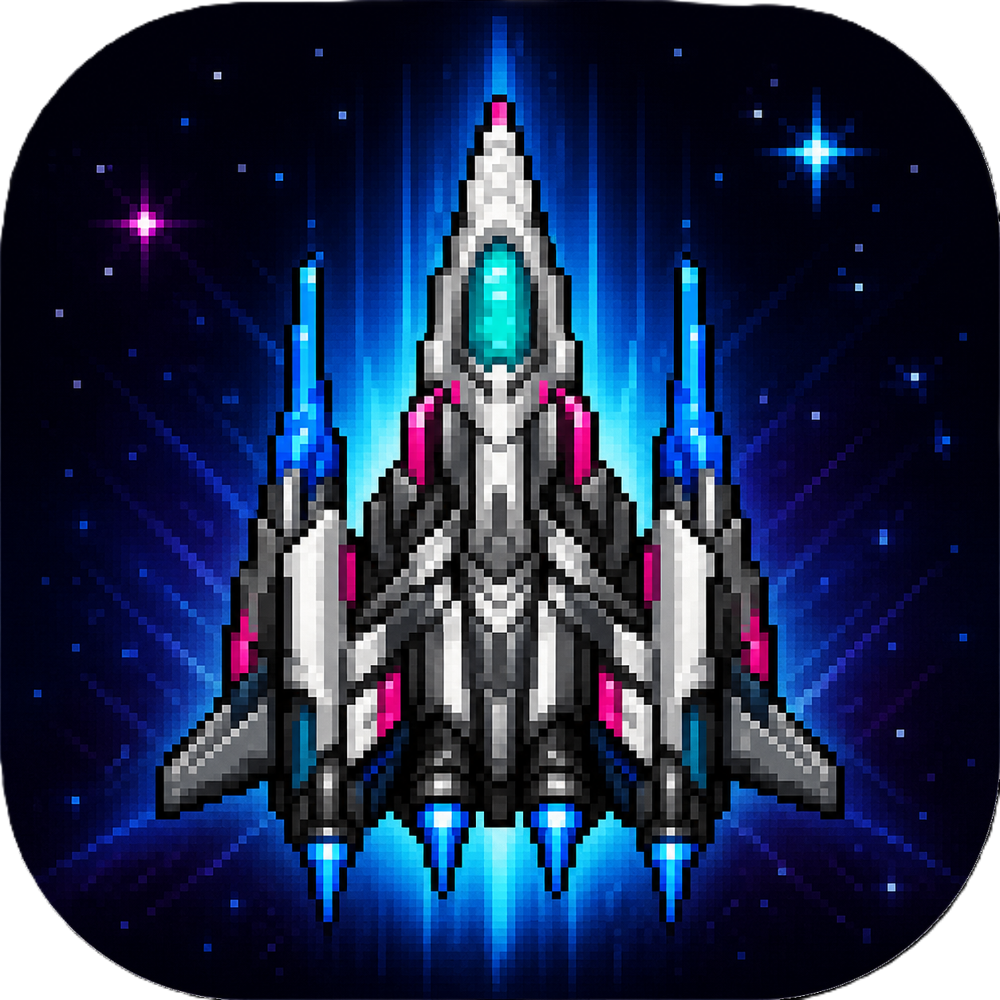

#  Galaxy Defender (Web Version)



##  ゲーム概要

**Galaxy Defender** は、宇宙を舞台にしたシューティングゲームです。
プレイヤーは戦闘機を操作し、迫りくる敵を撃ち落としてスコアを稼ぎます。

シンプルな操作ながら、スコアが上がるほど敵のスピードが上昇し、
さらに特殊なボーナス敵や超ボーナス敵が出現するなど、
スリルのあるゲーム体験が楽しめます。

---

##  操作方法

* **マウス移動**：戦闘機の移動
* **クリック**：攻撃（レーザー発射）

---

##  ゲーム要素

### 通常敵

* 倒すと **+100点**
* 時間経過でどんどん増えていく

### ボーナス敵

* ランダム出現＆一定時間で消滅
* 倒すと **+500点**

### 超ボーナス敵

* 高速で画面を横切るレア敵
* 倒すと **+1000点**

---

##  特徴

* スコアに応じてゲームスピードが上昇
* シンプルで直感的な操作
* 爆発エフェクトやレーザー演出あり

---

##  制作背景

本作品は、**昨年 Python（Tkinter）で制作したゲームのWeb版改良版**です。
ブラウザ上で遊べるように再設計し、ゲーム性の向上や新要素を追加しています。

---

##  画像について

本ゲームで使用されている画像素材は、**AIによって生成されたもの**を使用しています。

---

##  ファイル構成

```
index.html
script.js
style.css
image/
```

---

##  起動方法

`index.html` をブラウザで開くだけでプレイ可能です。

---

##  ひとこと

シンプルだけど、やればやるほど難しくなるタイプのゲームです。
ハイスコア目指して頑張ってください 
